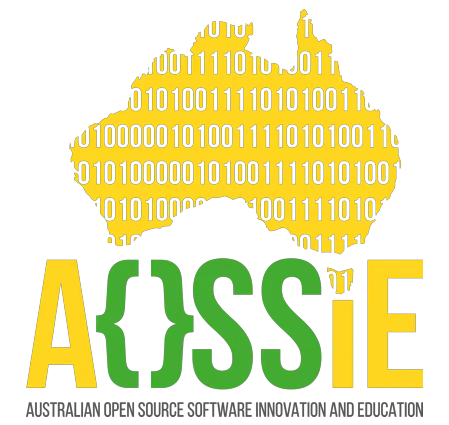

<!-- Don't delete it -->
<div name="readme-top"></div>

<!-- Organization Logo -->
<div align="center" style="display: flex; align-items: center; justify-content: center; gap: 16px;">
  
  
</div>

&nbsp;

<!-- Organization Name -->
<div align="center">

[](https://TODO.aossie.org/)

<!-- Correct deployed url to be added -->

</div>

<!-- Organization/Project Social Handles -->
<p align="center">
<!-- Telegram -->
<a href="https://t.me/StabilityNexus">
</a>
&nbsp;&nbsp;
<!-- X (formerly Twitter) -->
<a href="https://x.com/aossie_org">
</a>
&nbsp;&nbsp;
<!-- Discord -->
<a href="https://discord.gg/hjUhu33uAn">
</a>
&nbsp;&nbsp;
<!-- Medium -->
<a href="https://news.stability.nexus/">
  </a>
&nbsp;&nbsp;
<!-- LinkedIn -->
<a href="https://www.linkedin.com/company/aossie/">
  </a>
&nbsp;&nbsp;
<!-- Youtube -->
<a href="https://www.youtube.com/@StabilityNexus">
  </a>
</p>

---

<div align="center">
<h1>TODO: Project Name</h1>
</div>

[TODO](https://TODO.stability.nexus/) is a ... TODO: Project Description.

---

## 🚀 Features

TODO: List your main features here:

- **Feature 1**: Description
- **Feature 2**: Description
- **Feature 3**: Description
- **Feature 4**: Description

---

## 💻 Tech Stack

TODO: Update based on your project

### Frontend
- React / Next.js / Flutter / React Native
- TypeScript
- TailwindCSS

### Backend
- Flask / FastAPI / Node.js / Supabase
- Database: PostgreSQL / SQLite / MongoDB

### AI/ML (if applicable)
- LangChain / LangGraph / LlamaIndex
- Google Gemini / OpenAI / Anthropic Claude
- Vector Database: Weaviate / Pinecone / Chroma
- RAG / Prompt Engineering / Agent Frameworks

### Blockchain (if applicable)
- Solidity / solana / cardano / ergo Smart Contracts
- Hardhat / Truffle / foundry
- Web3.js / Ethers.js / Wagmi
- OpenZeppelin / alchemy / Infura

---

## ✅ Project Checklist

TODO: Complete applicable items based on your project type

- [ ] **The protocol** (if applicable):
   - [ ] has been described and formally specified in a paper.
   - [ ] has had its main properties mathematically proven.
   - [ ] has been formally verified.
- [ ] **The smart contracts** (if applicable):
   - [ ] were thoroughly reviewed by at least two knights of The Stable Order.
   - [ ] were deployed to: [Add deployment details]
- [ ] **The mobile app** (if applicable):
   - [ ] has an _About_ page containing the Stability Nexus's logo and pointing to the social media accounts of the Stability Nexus.
   - [ ] is available for download as a release in this repo.
   - [ ] is available in the relevant app stores.
- [ ] **The AI/ML components** (if applicable):
   - [ ] LLM/model selection and configuration are documented.
   - [ ] Prompts and system instructions are version-controlled.
   - [ ] Content safety and moderation mechanisms are implemented.
   - [ ] API keys and rate limits are properly managed.

---

## 🔗 Repository Links

TODO: Update with your repository structure

1. [Main Repository](https://github.com/AOSSIE-Org/TODO)
2. [Frontend](https://github.com/AOSSIE-Org/TODO/tree/main/frontend) (if separate)
3. [Backend](https://github.com/AOSSIE-Org/TODO/tree/main/backend) (if separate)

---

## 🏗️ Architecture Diagram

TODO: Add your system architecture diagram here

```
[Architecture Diagram Placeholder]
```

You can create architecture diagrams using:
- [Draw.io](https://draw.io)
- [Excalidraw](https://excalidraw.com)
- [Lucidchart](https://lucidchart.com)
- [Mermaid](https://mermaid.js.org) (for code-based diagrams)

Example structure to include:
- Frontend components
- Backend services
- Database architecture
- External APIs/services
- Data flow between components

---

## 🔄 User Flow

TODO: Add user flow diagrams showing how users interact with your application

```
[User Flow Diagram Placeholder]
```

### Key User Journeys

TODO: Document main user flows:

1. **User Journey 1**: Description
   - Step 1
   - Step 2
   - Step 3

2. **User Journey 2**: Description
   - Step 1
   - Step 2
   - Step 3

3. **User Journey 3**: Description
   - Step 1
   - Step 2
   - Step 3

---

## �🍀 Getting Started

### Prerequisites

TODO: List what developers need installed

- Node.js 18+ / Python 3.9+ / Flutter SDK
- npm / yarn / pnpm
- [Any specific tools or accounts needed]

### Installation

TODO: Provide detailed setup instructions

#### 1. Clone the Repository

```bash
git clone https://github.com/AOSSIE-Org/TODO.git
cd TODO
```

#### 2. Install Dependencies

```bash
npm install
# or
yarn install
# or
pnpm install
```

#### 3. Configure Environment Variables(.env.example)

Create a `.env` file in the root directory:

```env
# Add your environment variables here
API_KEY=your_api_key
DATABASE_URL=your_database_url
```

#### 4. Run the Development Server

```bash
npm run dev
# or
yarn dev
# or
pnpm dev
```

#### 5. Open your Browser

Navigate to [http://localhost:3000](http://localhost:3000) to see the application.

For detailed setup instructions, please refer to our [Installation Guide](./docs/INSTALL_GUIDE.md) (if you have one).

---

## 📱 App Screenshots

TODO: Add screenshots showcasing your application

|  |  |  |
|---|---|---|
| Screenshot 1 | Screenshot 2 | Screenshot 3 |

---

## 🙌 Contributing

⭐ Don't forget to star this repository if you find it useful! ⭐

Thank you for considering contributing to this project! Contributions are highly appreciated and welcomed. To ensure smooth collaboration, please refer to our [Contribution Guidelines](./CONTRIBUTING.md).

---

## ✨ Maintainers

TODO: Add maintainer information

- [Maintainer Name](https://github.com/username)
- [Maintainer Name](https://github.com/username)

---

## 📍 License

This project is licensed under the GNU General Public License v3.0.
See the [LICENSE](LICENSE) file for details.

---

## 💪 Thanks To All Contributors

Thanks a lot for spending your time helping TODO grow. Keep rocking 🥂

[](https://github.com/AOSSIE-Org/TODO/graphs/contributors)

© 2025 AOSSIE 
